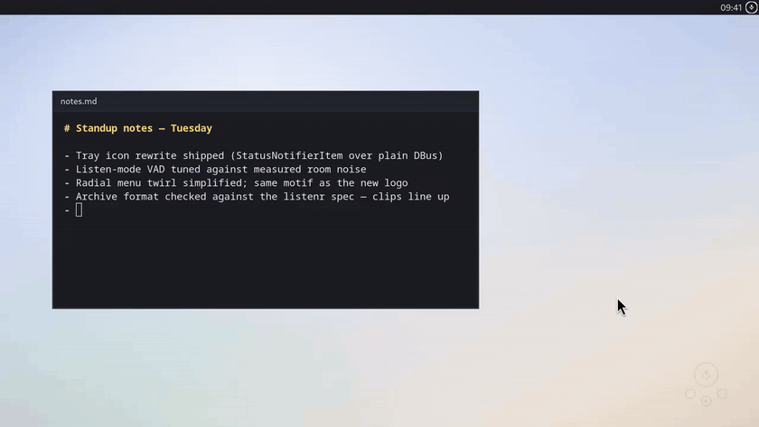

#  dictatr

Hotkey voice dictation for Linux desktops, backed by a local
[Lemonade](https://lemonade-server.ai) Whisper server. Press a hotkey, speak,
and the transcript is typed at your cursor (or copied to the clipboard).
Recording stops by itself when you stop talking. Nothing leaves your machine.

Every accepted dictation is archived in
[listenr](https://github.com/Rebreda/listenr)'s on-disk format
(`audio/YYYY-MM-DD/clip_*.wav` plus append-only `manifest.jsonl`), so daily
dictation doubles as ASR fine-tuning data. listenr itself is not required;
dictatr just writes a listenr-compatible archive.

<p align="center">
  
</p>

## Install

rpm and deb builds are attached to
[GitHub releases](https://github.com/Rebreda/dictatr/releases).

```bash
sudo dnf install ./dictatr-*.rpm        # or: sudo apt install ./dictatr_*.deb
```

That is the whole install. The tray autostarts and offers a setup wizard
the first time it runs; `dictate-setup` opens it again whenever you want.
It walks four pages:

| Page | What it does |
| --- | --- |
| Engine | finds a running Lemonade, or installs and starts a private one and pulls the speech model, or points at any OpenAI-compatible endpoint |
| Typing | asks the desktop for permission to type at the cursor, then types a test line to prove it |
| Hotkeys | binds Ctrl+Alt+D, Ctrl+Alt+Space, Ctrl+Alt+Q, Ctrl+Alt+S, Ctrl+Alt+C and Ctrl+Alt+A through the shortcuts portal |
| Try it | one real dictation, so you leave knowing the chain works |

Nothing here needs root and nothing is written outside your home
directory. Package details are in [docs/packaging.md](docs/packaging.md).

**From source** (Fedora names; adapt for your distro):

```bash
sudo dnf install pipewire-utils wl-clipboard libnotify   # mic, clipboard, notifications
sudo dnf install gtk4 python3-gobject gtk4-layer-shell   # tray, menu, wizard
./install.sh                                             # uv sync, symlinks, autostart
dictate setup                                            # same wizard
```

[uv](https://docs.astral.sh/uv/) manages the env; `websockets` is the only
Python dependency. Without gtk4-layer-shell the menu still works as a
centered window (GNOME has no layer-shell protocol).

### The inference engine

dictatr talks to one Lemonade-compatible server. The wizard picks between
three provider kinds, and `dictate backend status` says which is live:

| Provider | Where it comes from |
| --- | --- |
| `managed` | a private `lemond` dictatr installs and runs itself, on its own port, models in the shared HuggingFace cache |
| `system` | a [Lemonade](https://lemonade-server.ai) already running on this machine (port 13305, or 8080) |
| `custom` | any OpenAI-compatible endpoints, configured per capability |

Dictation needs one model, `Moonshine-Medium-Streaming`, which the wizard
pulls. Ask mode, recall and spoken answers need more; see
[docs/guide.md](docs/guide.md#backends).

## Usage

```
dictate            listen, auto-stop on silence, type at cursor
dictate clip       same, deliver to clipboard
dictate cancel     abort without transcribing
dictate file PATH  transcribe an audio file to the clipboard
dictate-menu       floating radial menu (toggle; number keys, Esc)
dictate listen     always-on capture into the archive
dictate gc         quarantine junk archive clips, purge old trash
dictate setup      the setup wizard again (also dictate-setup)
dictate backend    inference backend: status, start, stop, pull, models
dictate-tray       tray icon: state at a glance, quick actions (autostarts)
dictate-chat       floating voice chat: live transcript, spoken answers
dictate-suggest    radial of things to do with the selected text
```

The tray icon shows a record icon while always-on capture is live;
left-click opens the radial menu, right-click gets quick actions. The menu
blooms at the cursor when `gtk4-layer-shell` is installed. Speech is
segmented server-side by the streaming model's neural VAD, so there are no
energy thresholds to tune per room.

Beyond plain dictation there is **always-on capture** (`dictate listen`
archives every utterance until stopped, and `dictate gc` keeps the archive
clean) and **ask mode** (speak a question, a local LLM answers, with
semantic recall over everything you've dictated). Details, design notes,
and all configuration variables live in [docs/guide.md](docs/guide.md).

## Working on it

`uv sync`, `./install.sh` once, then `./dev` for the loop:

```bash
./dev restart    # start the tray from this checkout
./dev status     # what is running, and what backend it found
./dev test       # pytest
./dev doctor     # find a second dictatr competing with this one
```

The rest, including how to run a dictation against a scripted server with
no microphone, is in [docs/development.md](docs/development.md).

## License

MIT: see [LICENSE](LICENSE).
