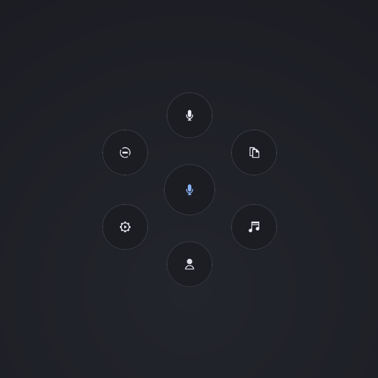
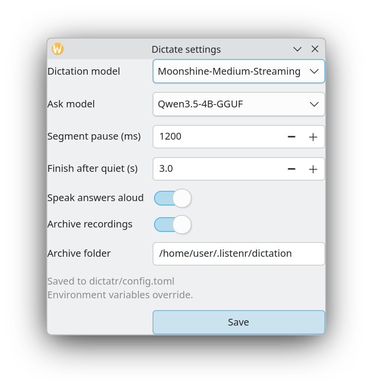

# dictatr

Hotkey voice dictation for Linux desktops, backed by a local
[Lemonade](https://lemonade-server.ai) Whisper server. Press a hotkey, speak,
and the transcript is typed at your cursor (or copied to the clipboard).
Recording stops by itself when you stop talking. Nothing leaves your machine.

Every accepted dictation is archived in
[listenr](https://github.com/Rebreda/listenr)'s on-disk format
(`audio/YYYY-MM-DD/clip_*.wav` + append-only `manifest.jsonl`), so daily
dictation doubles as ASR fine-tuning data. The package mirrors listenr's
module layout (settings / storage / batch / realtime client) so it can be
merged into listenr as a `listenr dictate` subcommand later. (listenr itself
is not required — dictatr just writes a listenr-compatible archive.)

<p align="center">
  
  
</p>

## Install

**1. Lemonade** — the local inference server everything runs on. Install
[Lemonade Server](https://lemonade-server.ai), make sure it's running, and
pull the models you want:

```bash
lemonade pull Moonshine-Medium-Streaming   # dictation (ASR) — required
lemonade pull Whisper-Large-v3-Turbo       # always-on capture (optional)
lemonade pull Qwen3.5-4B-GGUF              # ask mode (optional)
lemonade pull nomic-embed-text-v1-GGUF     # ask-mode recall (optional)
lemonade pull kokoro-v1                    # spoken answers, TTS (optional)
lemonade status                            # verify the server is up
```

**2. Distro packages** (Fedora names — adapt for your distro):

```bash
sudo dnf install pipewire-utils wl-clipboard libnotify   # mic, clipboard, notifications
sudo dnf install gtk4 python3-gobject gtk4-layer-shell   # optional: floating menu
sudo dnf install ydotool && sudo systemctl enable --now ydotool   # optional: type at cursor
```

Without ydotool, transcripts go to the clipboard instead of typing at the
cursor. Without gtk4-layer-shell the menu still works as a centered window
(GNOME has no layer-shell protocol).

**3. dictatr:**

```bash
./install.sh   # uv sync, symlinks into ~/.local/bin, .desktop entries, KDE hotkeys
```

[uv](https://docs.astral.sh/uv/) manages the env; `websockets` is the only
Python dependency.

**4. Hotkeys** — on KDE, `install.sh` binds Ctrl+Alt+D (dictate toggle),
Ctrl+Alt+Space (menu), Ctrl+Alt+C (cancel), Ctrl+Alt+A (always-on capture
toggle); Plasma loads them at next login,
or assign them now in System Settings → Shortcuts ("Dictate"). On other
desktops bind `dictate type`, `dictate-menu`, and `dictate cancel` in your
own shortcut settings — everything but the hotkey registration is
desktop-agnostic.

## Usage

```
dictate            listen, auto-stop on silence, type at cursor
dictate clip       same, deliver to clipboard
dictate cancel     abort without transcribing
dictate file PATH  transcribe an audio file to the clipboard
dictate-menu       floating radial menu (toggle; 1-4 keys, Esc)
dictate listen     always-on capture into the archive (see below)
dictate gc         quarantine junk archive clips, purge old trash
```

The menu appears at the cursor via a transparent layer-shell overlay when
`gtk4-layer-shell` is installed (KDE/wlroots compositors; click anywhere
outside to dismiss); without it, a small centered window.

## Always-on capture

`dictate listen` keeps the mic open and archives every utterance the VAD
hears — no typing, no clipboard, just the listenr-format archive filling up
with fine-tuning data and recall context. It pauses automatically while a
hotkey dictation is active (no duplicate rows), and if Lemonade is down the
audio is archived untranscribed and backfilled on the next start. Listen
transcribes via the batch endpoint, which streaming models don't support —
with the default Moonshine it falls back to Whisper-Large-v3-Turbo
(override with `DICTATE_LISTEN_MODEL`).

Toggle it with Ctrl+Alt+A, the record bubble in the menu (green while
live), or `dictate listen --toggle`. To have it on from login instead, use
the systemd units (`install.sh` installs them but never enables them — an
always-hot mic is your call):

```bash
systemctl --user enable --now dictatr-listen
systemctl --user enable --now dictatr-gc.timer   # daily junk sweep
```

Unattended capture archives junk too — breath-trigger clips, whisper's
"Thank you." hallucinations, a TV repeating itself. `dictate gc` sweeps the
archive: junk rows are *quarantined* (audio moved to `trash/`, manifest row
marked and excluded from recall), not deleted — a false positive would be
unrecoverable — and trash older than 30 days is purged for good.
Interactive dictations get gentle rules (only empty or degenerate rows);
listen-mode rows get the aggressive ones. `dictate gc --dry-run` previews,
`dictate gc --restore UID` brings a clip back.

## How it decides when you stopped talking

With the default Moonshine streaming model, Lemonade's `/realtime` WebSocket
does the VAD server-side with the model's bundled neural TEN-VAD
([src/dictatr/engine.py](src/dictatr/engine.py)) — robust against keyboard
clicks and mic auto-gain, with word-level streaming deltas.

Non-streaming models (Whisper) automatically fall back to client-side
adaptive VAD + batch transcription ([src/dictatr/vad.py](src/dictatr/vad.py)):
whisper.cpp's realtime VAD over-segments mid-sentence and hallucinates on
breath segments (measured on real recordings), while batch transcription of
the client-detected utterance is flawless. Force a mode with
`DICTATE_MODE=realtime|batch`.

## Ask mode

The ask bubble (or `dictatr ask`) captures a spoken question and answers it
with a local LLM via Lemonade — answer on the clipboard, notification
preview, and optionally spoken aloud with Kokoro TTS (toggle in Settings or
`speak_answers = false`). Before answering, the question is semantically
matched against your dictation archive (listenr's embed-once-and-cache
approach, via Lemonade's `/embeddings` endpoint and the 75 MB
nomic-embed-text model) and relevant past dictations are given to the LLM —
so "what did I say about X" works. Disable with `recall = false`.

The default ask model is Qwen3.5-4B with thinking disabled: ~2 s answers
warm. Reasoning models (gpt-oss, larger Qwen) work but push voice latency
to 15-45 s. `dictatr ask --quiet` skips TTS and notifications and delivers
the answer like a dictation.

Ask mode can also use local tools instead of guessing: current time
(`date`), file search in your home directory (`find`, read-only), your
local calendar (khal/calcurse when installed), and `remember` — lasting
facts land in `memories.jsonl` in the archive and are loaded into every
future ask. Archived dictations additionally get LLM-extracted concept
tags (work, code, todo, ...) written into the manifest's listenr
`categories` field plus an aggregate `cache/concepts.json` index;
`dictatr tag` backfills older rows.

## Configuration (environment variables)

| Variable | Default | Meaning |
|---|---|---|
| `LEMONADE_URL` | `http://localhost:8080/api/v1` | Lemonade API base |
| `DICTATE_MODEL` | `Moonshine-Medium-Streaming` | ASR model (streaming models use realtime mode) |
| `DICTATE_ARCHIVE` | `~/.listenr/dictation` | listenr-format archive dir, `off` to disable |
| `DICTATE_VAD_THRESHOLD` | `0.02` | speech trigger floor (matches listenr tuning) |
| `DICTATE_VAD_SILENCE_MS` | `1200` | pause that ends the utterance |
| `DICTATE_VAD_PREFIX_MS` | `250` | pre-roll kept before the first word |
| `DICTATE_MAX_SEC` | `25` | hard cap on utterance length |
| `DICTATE_MAX_WAIT` | `20` | give up when no speech for this many seconds |
| `DICTATE_MODE` | batch | `realtime` = Lemonade server-side VAD |
| `DICTATE_LLM_MODEL` | `Qwen3.5-4B-GGUF` | ask-mode chat model |
| `DICTATE_RECALL` | `true` | ask-mode semantic recall over the archive |
| `DICTATE_EMBED_MODEL` | `nomic-embed-text-v1-GGUF` | recall embedding model |
| `DICTATE_SPEAK` | `true` | speak ask answers via Kokoro TTS |
| `DICTATE_INPUT` | unset | stream a wav file instead of the mic (testing) |
| `DICTATE_LISTEN_TAG` | `false` | concept-tag rows archived by `listen` (keeps the LLM warm) |
| `DICTATE_LISTEN_MODEL` | auto | batch ASR for `listen`; Whisper-Large-v3-Turbo when the main model is streaming |
| `DICTATE_GC_MIN_SEC` | `1.0` | gc: listen clips shorter than this and under min words are junk |
| `DICTATE_GC_MIN_WORDS` | `2` | gc: word floor paired with the duration floor |
| `DICTATE_GC_PURGE_DAYS` | `30` | gc: quarantined trash older than this is deleted |

## License

MIT — see [LICENSE](LICENSE).
