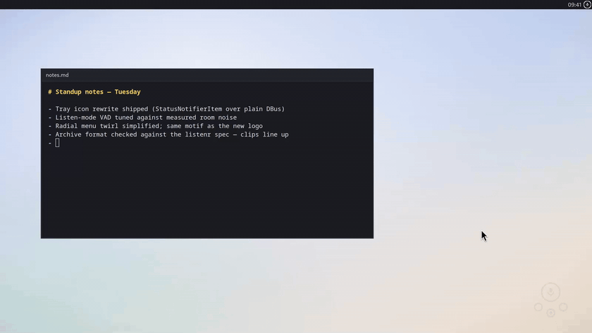

#  dictatr

Hotkey voice dictation for Linux desktops, backed by a local
[Lemonade](https://lemonade-server.ai) Whisper server. Press a hotkey, speak,
and the transcript is typed at your cursor (or copied to the clipboard).
Recording stops by itself when you stop talking. Nothing leaves your machine.

Every accepted dictation is archived in
[listenr](https://github.com/Rebreda/listenr)'s on-disk format
(`audio/YYYY-MM-DD/clip_*.wav` plus append-only `manifest.jsonl`), so daily
dictation doubles as ASR fine-tuning data. listenr itself is not required;
dictatr just writes a listenr-compatible archive.

<p align="center">
  
</p>

## Install

**1. Lemonade**, the local inference server everything runs on. Install
[Lemonade Server](https://lemonade-server.ai) and make sure it's running:

```bash
lemonade pull Moonshine-Medium-Streaming   # dictation model (required)
lemonade status                            # verify the server is up

# optional models:
# lemonade pull Whisper-Large-v3-Turbo     # `dictate file` transcription
# lemonade pull Qwen3.5-4B-GGUF            # ask mode
# lemonade pull nomic-embed-text-v1-GGUF   # ask-mode recall
# lemonade pull kokoro-v1                  # spoken answers (TTS)
```

**2. Distro packages** (Fedora names; adapt for your distro):

```bash
sudo dnf install pipewire-utils wl-clipboard libnotify   # mic, clipboard, notifications

# optional:
# sudo dnf install gtk4 python3-gobject gtk4-layer-shell            # floating menu
# sudo dnf install ydotool && sudo systemctl enable --now ydotool   # type at cursor
```

Without ydotool, transcripts go to the clipboard instead of typing at the
cursor. On Fedora the stock ydotool service also needs a socket fix or
typing silently fails; see
[docs/guide.md](docs/guide.md#typing-at-the-cursor-ydotool). Without
gtk4-layer-shell the menu still works as a centered window (GNOME has no
layer-shell protocol).

**3. dictatr:**

```bash
./install.sh   # uv sync, symlinks into ~/.local/bin, .desktop entries, KDE hotkeys
```

[uv](https://docs.astral.sh/uv/) manages the env; `websockets` is the only
Python dependency.

**4. Hotkeys.** On KDE, `install.sh` binds Ctrl+Alt+D (dictate toggle),
Ctrl+Alt+Space (menu), Ctrl+Alt+C (cancel), and Ctrl+Alt+A (always-on
capture toggle); Plasma loads them at next login, or assign them now in
System Settings → Shortcuts ("Dictate"). On other desktops bind
`dictate type`, `dictate-menu`, and `dictate cancel` in your own shortcut
settings; everything but the hotkey registration is desktop-agnostic.

## Usage

```
dictate            listen, auto-stop on silence, type at cursor
dictate clip       same, deliver to clipboard
dictate cancel     abort without transcribing
dictate file PATH  transcribe an audio file to the clipboard
dictate-menu       floating radial menu (toggle; 1-4 keys, Esc)
dictate listen     always-on capture into the archive
dictate gc         quarantine junk archive clips, purge old trash
dictate-tray       tray icon: state at a glance, quick actions (autostarts)
```

The tray icon shows a record icon while always-on capture is live;
left-click opens the radial menu, right-click gets quick actions. The menu
blooms at the cursor when `gtk4-layer-shell` is installed. Speech is
segmented server-side by the streaming model's neural VAD, so there are no
energy thresholds to tune per room.

Beyond plain dictation there is **always-on capture** (`dictate listen`
archives every utterance until stopped, and `dictate gc` keeps the archive
clean) and **ask mode** (speak a question, a local LLM answers, with
semantic recall over everything you've dictated). Details, design notes,
and all configuration variables live in [docs/guide.md](docs/guide.md).

## License

MIT: see [LICENSE](LICENSE).
