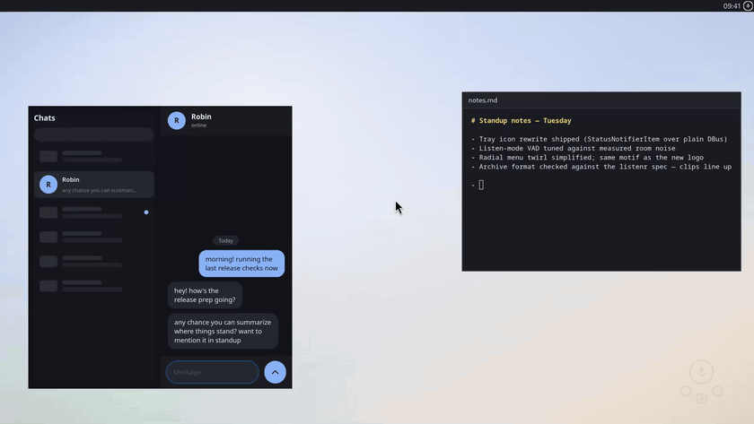
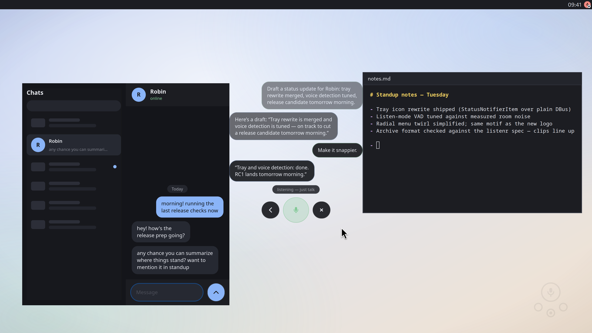

# dictatr guide

The details behind the short version in the [README](../README.md).

## Setup

`dictate setup` (or `dictate-setup`, or "Set up dictatr" in the tray
menu) opens the wizard. The tray offers it once, the first time it ever
starts: it writes a `setup_done` key whether you finish or close it, and
only the absence of that key triggers the offer, so it never nags twice.
`DICTATE_NO_SETUP=1` suppresses the offer entirely.

Four pages, each one a probe plus a single action, so every page doubles
as a diagnostic you can come back to:

1. **Engine.** Probes for a managed instance, then a system Lemonade on
   13305 and 8080, then configured custom endpoints. If it finds one it
   records the choice and moves on. If it finds nothing, "Set up the
   built-in engine" fetches the pinned `lemond` when the packages did
   not vendor it, starts it on a private port, pulls
   `Moonshine-Medium-Streaming` with live progress on the emblem arc,
   and pins it. "Use a custom endpoint" takes a base URL and an optional
   key, calls `/models` to check them, and writes them to config.
2. **Typing.** Runs the read-only portal probe. With the RemoteDesktop
   portal present, "Allow typing" performs the grant dance once and
   stores the token; without it, the page offers the ydotool user
   service instead. Either way it finishes by typing a test line into
   the page's own entry, so the result is observed rather than assumed.
3. **Hotkeys.** Binds the four defaults through the GlobalShortcuts
   portal and shows the triggers the desktop actually assigned, which
   are not always the ones requested. It also starts the tray if it is
   not running, since the tray owns the live shortcut session. Desktops
   with no portal get the `dictate-hotkeys` KDE config writer instead.
4. **Try it.** One real dictation into a text box, through whatever the
   previous pages configured.

The wizard is drawn in the radial kit's vocabulary (`ui/radial.py`): the
page emblem is a `ProgressBubble` orbited by one bubble per step, and the
orbit rotates to bring the current step to the top, so going back is the
same motion in reverse. Escape backs up one page, and closes the wizard
on the first. Every probe, download and portal call runs on a worker
thread; the window never blocks.

`DICTATR_SETUP_STEP=N` opens straight on one page, for looking at a page
without walking the whole wizard.

## The tray and the menu

<p align="center">
  
</p>
<p align="center">
  
</p>

The tray icon is a StatusNotifierItem implemented over plain DBus; it
works on Plasma and most Wayland bars, and GNOME needs its AppIndicator
extension. The icon is the recording indicator: dark mic when idle,
green while always-on capture is live, and red while a hotkey session
records, with a corner badge for where the transcript will go (caret =
typed at the cursor, clipboard, chat bubble = ask mode). A green
checkmark flashes for a couple of seconds after a transcript is
delivered, then the icon returns to idle. The tooltip spells the same
state out. Left-click opens the radial menu,
middle-click toggles always-on capture, right-click gets dictate / ask /
always-on / gc / settings. `install.sh` autostarts it at login.

The menu appears at the cursor via a transparent layer-shell overlay when
`gtk4-layer-shell` is installed (KDE and wlroots compositors; click
anywhere outside to dismiss). Without it, a small centered window. The
ring holds dictate, clipboard, ask, always-on, More, and cancel. More
folds file transcription, archive cleanup, and settings into a submenu:
the ring twirls into the hub, the chosen bubble becomes the hub, and its
children bloom out. The hub is then a back button; Escape backs out one
level and number keys pick from the visible ring.

## Global hotkeys

The setup wizard binds these, and the tray re-binds them through the
GlobalShortcuts desktop portal at every startup: Ctrl+Alt+D dictate,
Ctrl+Alt+Space menu, Ctrl+Alt+C cancel, Ctrl+Alt+A always-on toggle. On Plasma 6 the bindings appear in
System Settings natively and are remembered; GNOME 48+ asks once with a
consent dialog. When the portal bind succeeds while old
`bin/dictate-hotkeys` entries exist in kglobalshortcutsrc, the tray
deletes the old entries so a press fires once, not twice. Desktops
without the portal (wlroots compositors) keep using `dictate-hotkeys`
(KDE config writer) or bind the `dictate` commands in their own
settings; the tray logs one line and stays out of the way.

## Typing at the cursor

Delivery tries three tiers in order, and the outcome notification stays
truthful ("Typed:" only when text was really typed, "Copied" otherwise):

1. **RemoteDesktop portal** (`ui/portal_typed.py`): keysym injection
   through xdg-desktop-portal, no special privileges. The grant is
   remembered across sessions on Plasma 6.1+ / GNOME 46+ as a token in
   `~/.local/state/dictatr/portal-typing-token`, so the permission
   dialog appears once ever. A dictation never pops that dialog
   mid-flow: without a stored token this tier is skipped entirely. The
   setup wizard's typing page performs the grant; to do it by hand, run
   `python3 ui/portal_typed.py --grant`, and `--check` prints what the
   portal offers without any dialog.
2. **ydotool**: kernel-level input, works on any Wayland or X11 desktop
   (setup below).
3. **Clipboard**: `wl-copy` plus a "Copied" notification.

Set `DICTATE_NO_PORTAL=1` to skip the portal tier (the demo harness does
this so its ydotool shim keeps capturing the typing).

**Package installs**: the rpm/deb ships a udev rule that grants the
logged-in user access to `/dev/uinput`, so the daemon runs rootless as
a user service. The wizard's typing page enables it when the portal is
missing, or do it by hand:

```bash
systemctl --user enable --now dictatr-ydotoold
```

**Source installs** hit a stock-unit trap instead: Fedora's
`ydotool.service` runs the daemon as root with its socket at
`/tmp/.ydotool_socket` (root-only), while the `ydotool` client looks for
`/run/user/<uid>/.ydotool_socket`; with that mismatch every `ydotool
type` fails. Point the daemon at the client's path and hand the socket
to your user (replace 1000 with your uid):

```bash
sudo mkdir -p /etc/systemd/system/ydotool.service.d
sudo tee /etc/systemd/system/ydotool.service.d/override.conf <<'EOF'
[Service]
ExecStart=
ExecStart=/usr/bin/ydotoold --socket-path=/run/user/1000/.ydotool_socket --socket-own=1000:1000
EOF
sudo systemctl daemon-reload
sudo systemctl restart ydotool
ydotool type ''   # exits 0 when the socket is reachable
```

## Always-on capture

`dictate listen` holds a persistent `/realtime` session: the same
Moonshine + server-side TEN-VAD engine the hotkey uses, running forever.
Segments the server transcribes are archived the moment the transcript
arrives; segments it hears as noise are dropped and never touch disk. It
pauses automatically while a hotkey dictation is active (no duplicate
rows), pins the ASR model in Lemonade at startup (`lemonade load
--pinned`) so other models can't evict it, and reconnects with backoff if
the server goes away.

Toggle it with Ctrl+Alt+A, the record bubble in the menu (green while
live), the tray icon (middle-click, or the menu checkbox), or
`dictate listen --toggle`. To have it on from login instead, use the
systemd units. `install.sh` installs them but never enables them; an
always-hot mic is your call:

```bash
systemctl --user enable --now dictatr-listen
systemctl --user enable --now dictatr-gc.timer   # daily junk sweep
```

Unattended capture still archives some junk: ASR hallucinations on
breaths ("Thank you."), a TV repeating itself. `dictate gc` sweeps the
archive. Junk rows are *quarantined* (audio moved to `trash/`, manifest
row marked and excluded from recall), not deleted, because a false
positive would be unrecoverable; trash older than 30 days is purged for
good. Interactive dictations get gentle rules (only empty or degenerate
rows); listen-mode rows get the aggressive ones. `dictate gc --dry-run`
previews, `dictate gc --restore UID` brings a clip back.

## How it decides when you stopped talking

All microphone paths (hotkey dictation, ask, always-on) speak Lemonade's
`/realtime` WebSocket, where the streaming model's bundled neural TEN-VAD
segments speech server-side ([src/dictatr/engine.py](../src/dictatr/engine.py));
robust against keyboard clicks and mic auto-gain, with word-level
streaming deltas. There is deliberately no client-side VAD: energy
thresholds need per-room tuning and still misfire (measured, repeatedly).
The batch endpoint is used only for `dictate file`, with a Whisper
fallback since streaming models don't serve it.

## Ask mode

<p align="center">
  
</p>
<p align="center">
  
</p>

The ask bubble (or `dictatr ask`) captures a spoken question and answers
it with a local LLM via Lemonade: answer on the clipboard, notification
preview, and optionally spoken aloud with Kokoro TTS (toggle in Settings
or `speak_answers = false`). `dictate-chat` (the menu's "Ask the AI"
bubble) is the continued-conversation flavor: your words stream into a
floating pill as you speak, the answer appears beneath, and the mic
re-opens for the follow-up, history and all, entirely by voice. Before answering, the question is
semantically matched against your dictation archive (listenr's
embed-once-and-cache approach, via Lemonade's `/embeddings` endpoint and
the 75 MB nomic-embed-text model) and relevant past dictations are given
to the LLM, so "what did I say about X" works. Disable with
`recall = false`.

The default ask model is Qwen3.5-4B with thinking disabled: ~2 s answers
warm. Reasoning models (gpt-oss, larger Qwen) work but push voice latency
to 15-45 s. `dictatr ask --quiet` skips TTS and notifications and
delivers the answer like a dictation.

Ask mode can also use local tools instead of guessing: current time
(`date`), file search in your home directory (`find`, read-only), your
local calendar (khal/calcurse when installed), and `remember`, whose
lasting facts land in `memories.jsonl` in the archive and are loaded into
every future ask. Archived dictations additionally get LLM-extracted
concept tags (work, code, todo, ...) written into the manifest's listenr
`categories` field plus an aggregate `cache/concepts.json` index;
`dictatr tag` backfills older rows.

## Backends

dictatr talks to an OpenAI-compatible inference server through one
provider seam (`src/dictatr/backend/`). Three provider kinds, picked
automatically unless `backend` is set in config.toml:

- **managed**: dictatr's own private `lemond` (the Lemonade daemon).
  The binary is vendored by the packages at `/usr/lib/dictatr/lemond`
  or downloaded once to `~/.local/share/dictatr/lemond` (sha256-pinned
  release; see `packaging/lemond-version.env`). The instance keeps its
  state in `~/.local/share/dictatr/lemonade` with its own port and a
  generated API key, runs with `--no-broadcast`, and stores models in
  the shared HuggingFace cache so other local-AI apps reuse them.
- **system**: an existing Lemonade server, detected on ports 13305 and
  8080 (or at `backend_url`). This is the pre-backend-layer behavior;
  `LEMONADE_URL` still forces this provider at exactly that URL.
- **custom**: any OpenAI-compatible endpoints, configured per
  capability (asr / chat / tts / embed). `OPENAI_BASE_URL` and
  `OPENAI_API_KEY` fill whatever is left unset.

Auto-resolution order: a running managed lemond, then a detected
system server, then custom endpoints, then the default URL.

`dictatr backend status|start|stop|pull MODEL|models` manages the
backend from the command line; `pull` streams download progress.

Config keys (flat, in `~/.config/dictatr/config.toml`):

| Key | Meaning |
|---|---|
| `backend` | `managed`, `system` or `custom`; unset = auto |
| `backend_url` | server URL for the system provider |
| `asr_url` / `asr_key` / `asr_model` | custom ASR endpoint, key, model |
| `chat_url` / `chat_key` / `chat_model` | custom chat endpoint |
| `tts_url` / `tts_key` / `tts_model` | custom TTS endpoint |
| `embed_url` / `embed_key` / `embed_model` | custom embeddings endpoint |

## Configuration (environment variables)

Defaults < `~/.config/dictatr/config.toml` (written by the settings UI) <
environment.

| Variable | Default | Meaning |
|---|---|---|
| `LEMONADE_URL` | unset | forces the system provider at this API base |
| `OPENAI_BASE_URL` | unset | default base URL for the custom provider |
| `OPENAI_API_KEY` | unset | default API key for the custom provider |
| `DICTATE_MODEL` | `Moonshine-Medium-Streaming` | ASR model (a streaming model; drives all mic paths) |
| `DICTATE_ARCHIVE` | `~/.listenr/dictation` | listenr-format archive dir, `off` to disable |
| `DICTATE_VAD_THRESHOLD` | `0.02` | speech trigger floor (matches listenr tuning) |
| `DICTATE_VAD_SILENCE_MS` | `1200` | pause that ends the utterance |
| `DICTATE_VAD_PREFIX_MS` | `250` | pre-roll kept before the first word |
| `DICTATE_MAX_SEC` | `25` | hard cap on utterance length |
| `DICTATE_MAX_WAIT` | `20` | give up when no speech for this many seconds |
| `DICTATE_LLM_MODEL` | `Qwen3.5-4B-GGUF` | ask-mode chat model |
| `DICTATE_RECALL` | `true` | ask-mode semantic recall over the archive |
| `DICTATE_EMBED_MODEL` | `nomic-embed-text-v1-GGUF` | recall embedding model |
| `DICTATE_SPEAK` | `true` | speak ask answers via Kokoro TTS |
| `DICTATE_INPUT` | unset | stream a wav file instead of the mic (testing) |
| `DICTATE_NO_PORTAL` | unset | `1` disables the portal typing tier and the tray's portal hotkeys |
| `DICTATE_LISTEN_TAG` | `false` | concept-tag rows archived by `listen` (keeps the LLM warm) |
| `DICTATE_GC_MIN_SEC` | `1.0` | gc: listen clips shorter than this and under min words are junk |
| `DICTATE_GC_MIN_WORDS` | `2` | gc: word floor paired with the duration floor |
| `DICTATE_GC_PURGE_DAYS` | `30` | gc: quarantined trash older than this is deleted |

## Project layout

The package mirrors listenr's module layout (settings / storage / batch /
realtime client) so it can be merged into listenr as a `listenr dictate`
subcommand later. `src/dictatr/` is stdlib-only apart from `websockets`;
everything needing PyGObject lives in `ui/` and is shelled out to.

| Path | What lives there |
|---|---|
| `src/dictatr/backend/` | the provider seam: config, detection, managed lemond, client |
| `ui/radial.py` | the shared visual kit: bubbles, twirl transitions, submenus, progress arcs |
| `ui/menu.py`, `ui/chat.py`, `ui/tray.py` | the radial menu, voice chat, tray icon |
| `ui/setup.py` | the setup wizard |
| `ui/portal_typed.py` | RemoteDesktop portal typing helper |
| `packaging/` | `stage.sh` (the install tree), rpm spec, deb builder |

The demo assets in the README are generated by a reproducible capture
harness; see [docs/demo/README.md](demo/README.md).
