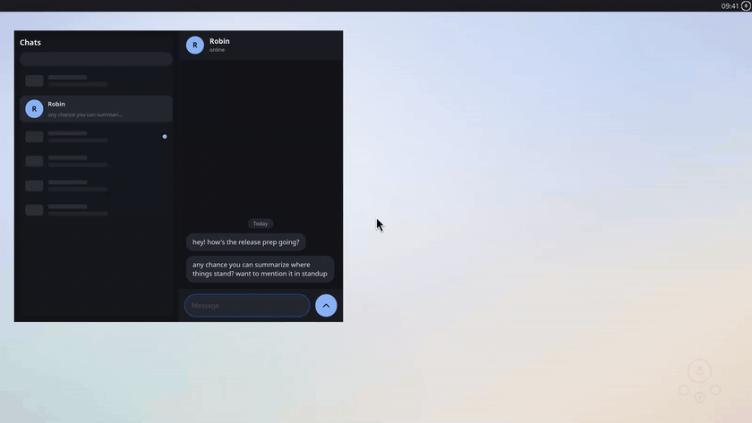
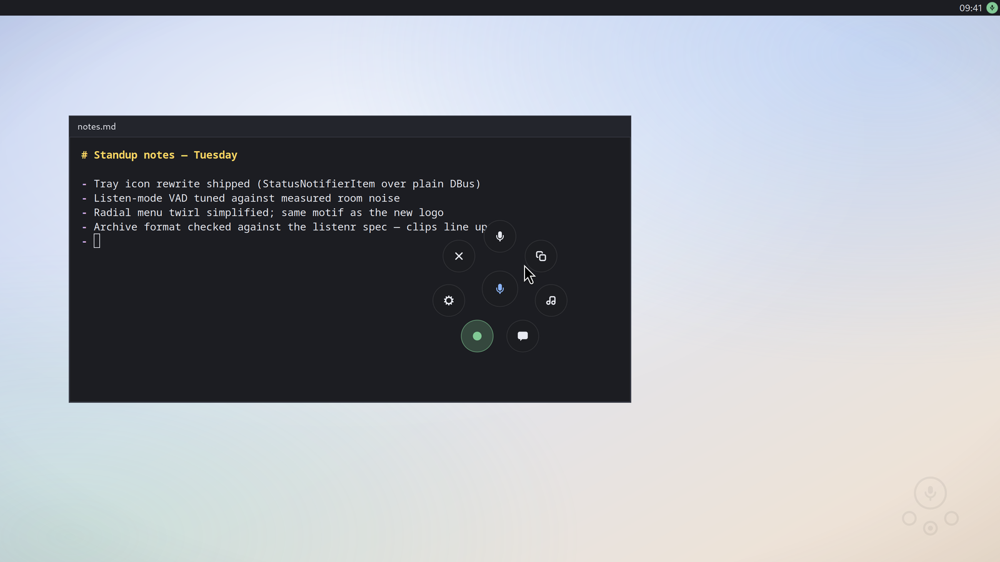

# dictatr guide

The details behind the short version in the [README](../README.md).

## The tray and the menu

<p align="center">
  
</p>
<p align="center">
  
</p>

The tray icon is a StatusNotifierItem implemented over plain DBus; it
works on Plasma and most Wayland bars, and GNOME needs its AppIndicator
extension. The icon is the recording indicator: dark mic when idle,
green while always-on capture is live, and red while a hotkey session
records, with a corner badge for where the transcript will go (caret =
typed at the cursor, clipboard, chat bubble = ask mode). A green
checkmark flashes for a couple of seconds after a transcript is
delivered, then the icon returns to idle. The tooltip spells the same
state out. Left-click opens the radial menu,
middle-click toggles always-on capture, right-click gets dictate / ask /
always-on / gc / settings. `install.sh` autostarts it at login.

The menu appears at the cursor via a transparent layer-shell overlay when
`gtk4-layer-shell` is installed (KDE and wlroots compositors; click
anywhere outside to dismiss). Without it, a small centered window.

## Global hotkeys

The tray binds the four defaults through the GlobalShortcuts desktop
portal at startup: Ctrl+Alt+D dictate, Ctrl+Alt+Space menu, Ctrl+Alt+C
cancel, Ctrl+Alt+A always-on toggle. On Plasma 6 the bindings appear in
System Settings natively and are remembered; GNOME 48+ asks once with a
consent dialog. When the portal bind succeeds while old
`bin/dictate-hotkeys` entries exist in kglobalshortcutsrc, the tray
deletes the old entries so a press fires once, not twice. Desktops
without the portal (wlroots compositors) keep using `dictate-hotkeys`
(KDE config writer) or bind the `dictate` commands in their own
settings; the tray logs one line and stays out of the way.

## Typing at the cursor

Delivery tries three tiers in order, and the outcome notification stays
truthful ("Typed:" only when text was really typed, "Copied" otherwise):

1. **RemoteDesktop portal** (`ui/portal_typed.py`): keysym injection
   through xdg-desktop-portal, no special privileges. The grant is
   remembered across sessions on Plasma 6.1+ / GNOME 46+ as a token in
   `~/.local/state/dictatr/portal-typing-token`, so the permission
   dialog appears once ever. A dictation never pops that dialog
   mid-flow: without a stored token this tier is skipped entirely. To
   grant deliberately, run `python3 ui/portal_typed.py --grant`;
   `--check` prints what the portal offers without any dialog.
2. **ydotool**: kernel-level input, works on any Wayland or X11 desktop
   (setup below).
3. **Clipboard**: `wl-copy` plus a "Copied" notification.

Set `DICTATE_NO_PORTAL=1` to skip the portal tier (the demo harness does
this so its ydotool shim keeps capturing the typing).

**Package installs**: the rpm/deb ships a udev rule that grants the
logged-in user access to `/dev/uinput`, so the daemon runs rootless as
a user service. Just enable it once:

```bash
systemctl --user enable --now dictatr-ydotoold
```

**Source installs** hit a stock-unit trap instead: Fedora's
`ydotool.service` runs the daemon as root with its socket at
`/tmp/.ydotool_socket` (root-only), while the `ydotool` client looks for
`/run/user/<uid>/.ydotool_socket`; with that mismatch every `ydotool
type` fails. Point the daemon at the client's path and hand the socket
to your user (replace 1000 with your uid):

```bash
sudo mkdir -p /etc/systemd/system/ydotool.service.d
sudo tee /etc/systemd/system/ydotool.service.d/override.conf <<'EOF'
[Service]
ExecStart=
ExecStart=/usr/bin/ydotoold --socket-path=/run/user/1000/.ydotool_socket --socket-own=1000:1000
EOF
sudo systemctl daemon-reload
sudo systemctl restart ydotool
ydotool type ''   # exits 0 when the socket is reachable
```

## Always-on capture

`dictate listen` holds a persistent `/realtime` session: the same
Moonshine + server-side TEN-VAD engine the hotkey uses, running forever.
Segments the server transcribes are archived the moment the transcript
arrives; segments it hears as noise are dropped and never touch disk. It
pauses automatically while a hotkey dictation is active (no duplicate
rows), pins the ASR model in Lemonade at startup (`lemonade load
--pinned`) so other models can't evict it, and reconnects with backoff if
the server goes away.

Toggle it with Ctrl+Alt+A, the record bubble in the menu (green while
live), the tray icon (middle-click, or the menu checkbox), or
`dictate listen --toggle`. To have it on from login instead, use the
systemd units. `install.sh` installs them but never enables them; an
always-hot mic is your call:

```bash
systemctl --user enable --now dictatr-listen
systemctl --user enable --now dictatr-gc.timer   # daily junk sweep
```

Unattended capture still archives some junk: ASR hallucinations on
breaths ("Thank you."), a TV repeating itself. `dictate gc` sweeps the
archive. Junk rows are *quarantined* (audio moved to `trash/`, manifest
row marked and excluded from recall), not deleted, because a false
positive would be unrecoverable; trash older than 30 days is purged for
good. Interactive dictations get gentle rules (only empty or degenerate
rows); listen-mode rows get the aggressive ones. `dictate gc --dry-run`
previews, `dictate gc --restore UID` brings a clip back.

## How it decides when you stopped talking

All microphone paths (hotkey dictation, ask, always-on) speak Lemonade's
`/realtime` WebSocket, where the streaming model's bundled neural TEN-VAD
segments speech server-side ([src/dictatr/engine.py](../src/dictatr/engine.py));
robust against keyboard clicks and mic auto-gain, with word-level
streaming deltas. There is deliberately no client-side VAD: energy
thresholds need per-room tuning and still misfire (measured, repeatedly).
The batch endpoint is used only for `dictate file`, with a Whisper
fallback since streaming models don't serve it.

## Ask mode

The ask bubble (or `dictatr ask`) captures a spoken question and answers
it with a local LLM via Lemonade: answer on the clipboard, notification
preview, and optionally spoken aloud with Kokoro TTS (toggle in Settings
or `speak_answers = false`). Before answering, the question is
semantically matched against your dictation archive (listenr's
embed-once-and-cache approach, via Lemonade's `/embeddings` endpoint and
the 75 MB nomic-embed-text model) and relevant past dictations are given
to the LLM, so "what did I say about X" works. Disable with
`recall = false`.

The default ask model is Qwen3.5-4B with thinking disabled: ~2 s answers
warm. Reasoning models (gpt-oss, larger Qwen) work but push voice latency
to 15-45 s. `dictatr ask --quiet` skips TTS and notifications and
delivers the answer like a dictation.

Ask mode can also use local tools instead of guessing: current time
(`date`), file search in your home directory (`find`, read-only), your
local calendar (khal/calcurse when installed), and `remember`, whose
lasting facts land in `memories.jsonl` in the archive and are loaded into
every future ask. Archived dictations additionally get LLM-extracted
concept tags (work, code, todo, ...) written into the manifest's listenr
`categories` field plus an aggregate `cache/concepts.json` index;
`dictatr tag` backfills older rows.

## Configuration (environment variables)

Defaults < `~/.config/dictatr/config.toml` (written by the settings UI) <
environment.

| Variable | Default | Meaning |
|---|---|---|
| `LEMONADE_URL` | `http://localhost:8080/api/v1` | Lemonade API base |
| `DICTATE_MODEL` | `Moonshine-Medium-Streaming` | ASR model (a streaming model; drives all mic paths) |
| `DICTATE_ARCHIVE` | `~/.listenr/dictation` | listenr-format archive dir, `off` to disable |
| `DICTATE_VAD_THRESHOLD` | `0.02` | speech trigger floor (matches listenr tuning) |
| `DICTATE_VAD_SILENCE_MS` | `1200` | pause that ends the utterance |
| `DICTATE_VAD_PREFIX_MS` | `250` | pre-roll kept before the first word |
| `DICTATE_MAX_SEC` | `25` | hard cap on utterance length |
| `DICTATE_MAX_WAIT` | `20` | give up when no speech for this many seconds |
| `DICTATE_LLM_MODEL` | `Qwen3.5-4B-GGUF` | ask-mode chat model |
| `DICTATE_RECALL` | `true` | ask-mode semantic recall over the archive |
| `DICTATE_EMBED_MODEL` | `nomic-embed-text-v1-GGUF` | recall embedding model |
| `DICTATE_SPEAK` | `true` | speak ask answers via Kokoro TTS |
| `DICTATE_INPUT` | unset | stream a wav file instead of the mic (testing) |
| `DICTATE_NO_PORTAL` | unset | `1` disables the portal typing tier and the tray's portal hotkeys |
| `DICTATE_LISTEN_TAG` | `false` | concept-tag rows archived by `listen` (keeps the LLM warm) |
| `DICTATE_GC_MIN_SEC` | `1.0` | gc: listen clips shorter than this and under min words are junk |
| `DICTATE_GC_MIN_WORDS` | `2` | gc: word floor paired with the duration floor |
| `DICTATE_GC_PURGE_DAYS` | `30` | gc: quarantined trash older than this is deleted |

## Project layout

The package mirrors listenr's module layout (settings / storage / batch /
realtime client) so it can be merged into listenr as a `listenr dictate`
subcommand later.

The demo assets in the README are generated by a reproducible capture
harness; see [docs/demo/README.md](demo/README.md).
